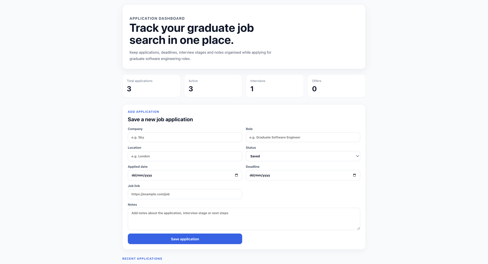
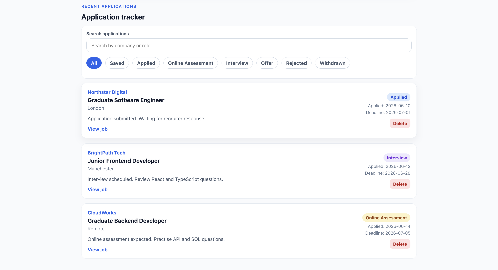

# GradTrack

GradTrack is a job application tracker built with React and TypeScript to help students and graduates manage their job search in one place.

## Project Status

✅ Core features completed

- Application tracking
- Dashboard statistics
- Search and filtering
- Local storage persistence
- Form validation
- Job links and notes

🚧 Planned improvements

- Edit existing applications
- Backend API
- Authentication
- Database integration
- Cloud deployment

_Last updated: July 2026_

## Features

- Add new job applications
- Delete applications
- Search by company or role
- Filter applications by status
- Dashboard statistics
- Save notes for each application
- Store job links
- Local storage persistence
- Form validation
- Responsive design

## Screenshots

### Dashboard

### Application Tracker

